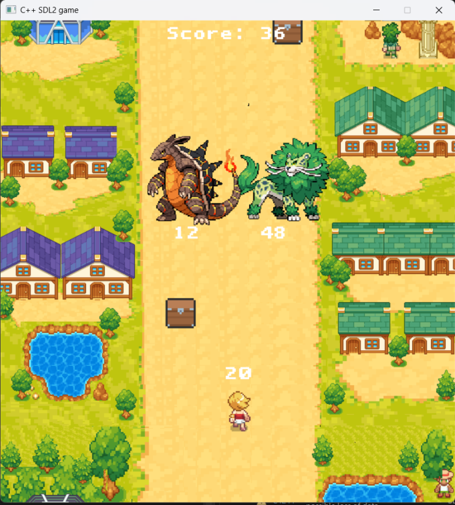

# Pokemon Thrown - A small game made with C++ and SDL2.

    <strong> Pokemon Thrown C++/SDL2 Game by Cao Anh Minh. </strong>

 <strong>Author</strong>: Cao Anh Minh

 <strong> Student ID </strong>: 24021563

- [0. Introduction](#0-introduction)
- [1. Preview](#1-preview)
- [2. Building And Running](#2-building-and-running)
- [3. How to play](#3-how-to-play)
- [4. Parameters](#4-parameters)
  * [A. Chest Buff](#a-chest-buff)
  * [B. Characters](#c-characters)
- [5. Controls](#5-controls-included-in-the-tutorial-of-the-game)
- [6. Scoring method](#6-scoring-method)
- [7. Sources](#7-sources)
- [8. Conclusion](#8-conclusion)
- [9. A Special Thanks](#9-a-special-thanks-to)

# 0. Introduction
Đây là game được em viết trong khoảng **6 tuần** và cũng là game đầu tiên mà em viết. Mong mọi người sẽ thích nó!

Các thư viện đi kèm: **SDL2**, **SDL2-image**, **SDL2-ttf** và **SDL2-mixer**.

# 1. Preview
Demo Game: https://youtu.be/QUiqTDwUxIw

# 2. Building And Running
  - Chạy file **main.exe** để chơi
  - Sử dụng [MinGW-w64](https://www.mingw-w64.org/) và các thư viện [SDL2](https://www.libsdl.org/) đi kèm để build file **main.cpp**. Chạy file vừa build được để chơi.
# 3. How to play
Né hoặc bắn hạ các quái vật: **Rồng**, **Sư tử**, **Rắn độc**, **Capybara**. Chạm phải các vật thể này sẽ bị trừ máu.

Ăn thêm các vật phẩm cần thiết để hỗ trợ cho màn chơi.

# 4. Parameters
## A. Chest Buff
| Vật phẩm                                          | Tác dụng                                                       |
|---------------------------------------------------|----------------------------------------------------------------|
| Health upgrade                                    | Cộng thêm 10 máu cho người chơi                                |
| Bullet speed                                      | Cộng thêm tốc độ đạn bắn                                       |
| Bullet Damage                                     | Cộng thêm 1 damage cho đạn                                     |
| Player Speed buff                                 | Tăng tốc độ di chuyển cho người chơi                           |

## B. Characters
| Nhân vật                                                                                    | Tên                 | Số máu                                 |
|---------------------------------------------------------------------------------------------|---------------------|----------------------------------------|
|                                                | **Main Character**  | 10 + **Số máu ăn thêm**                |
|                                           | **Fire Dragon**     | 15 + **Theo thời gian**                |
|                                             | **Leaf lion**       | 20 + **Theo thời gian**                |
|                                        | **Poison Hydra**    | 20 + **Theo thời gian**                |
|                                          | **Stone Capy**      | 20 + **Theo thời gian**                |

# 5. Controls (Included in the Tutorial of the Game)
  - Di chuyển: **A**, **D** (trái phải).
# 6. Scoring method
Tăng dần theo thời gian tính theo giây.
# 7. Sources
Game được em tự viết hoàn toàn với một số tham khảo từ:
  - Game **Arrow a row**.
  - Cách làm việc với SDL từ **LazyFoo**.
  - Một số thuật toán từ **ChatGPT**.

Tất cả các dữ liệu(bao gồm **Hình ảnh**, **Âm thanh**, **Font chữ**) đều được lấy miễn phí từ **Internet**.
# 8. Conclusion
Với tất cả những điều như trên thì em nghĩ Game này xứng đáng được **10đ**, nhưng nếu có thấp hơn thì em cũng xin chấp nhận. 
# 9. A Special Thanks To:
- **TS. Lê Đức Trọng** - Người hướng dẫn, Giảng viên.
